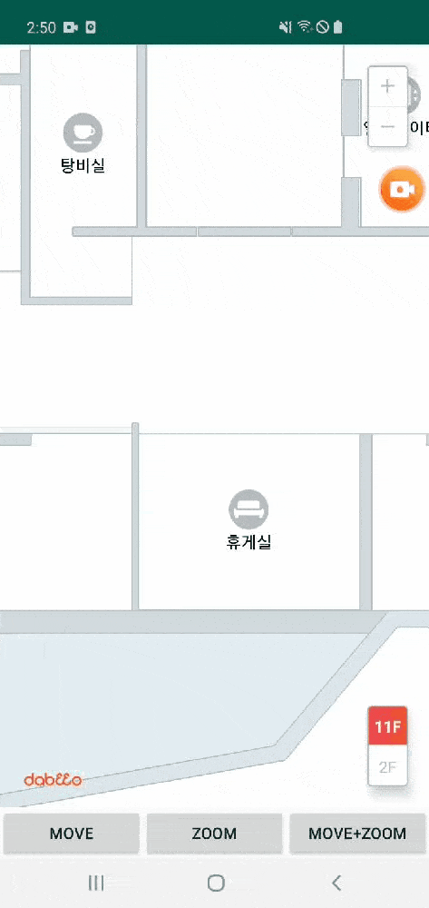

## Map Animation

SDK API 통해 지도 애니메이션을 사용하는 액티비티 입니다.



## Sample Code

- MapAnimationActivity.kt

    - Move
	```kotlin
	mMapView.center = Point(mRandom.nextDouble(mapInfo.size.width), mRandom.nextDouble(mapInfo.size.height), 0.0)
	```

	- Zoom
	```kotlin
	mMapView.zoom = mRandom.nextDouble(11.0)
	```

	- Move&Zoom
	```kotlin
	val movePoint = Point(
        mRandom.nextDouble(mapInfo.size.width),
        mRandom.nextDouble(mapInfo.size.height),
        0.0
    )
    val zoomLevel = mRandom.nextDouble(11.0)

    mMapView.setView(movePoint, zoomLevel, true)
	```