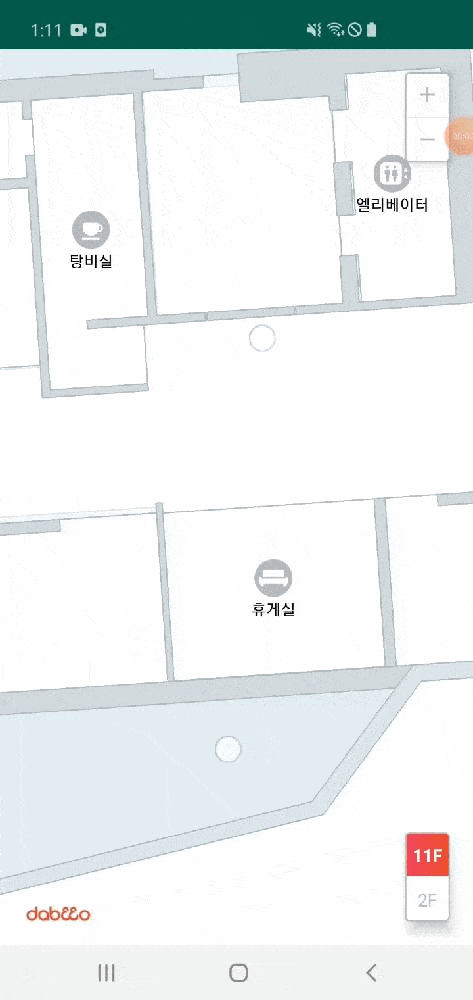

## Init MapView

에디터에서 작업한 지도를 로드하는 액티비티 입니다.



## Sample Code

- activity_simple_viewer.xml
	```xml
	<?xml version="1.0" encoding="utf-8"?>  
	<layout xmlns:app="http://schemas.android.com/apk/res-auto">  
	    <androidx.constraintlayout.widget.ConstraintLayout 		
	      xmlns:android="http://schemas.android.com/apk/res/android"  
		  android:layout_width="match_parent"  
		  android:layout_height="match_parent">  
  
	        <fragment  
			  android:id="@+id/fragment_mapview"  
			  android:name="com.dabeeo.maps.indoormap.MapView"  
			  android:layout_width="0dp"  
			  android:layout_height="0dp"  
			  app:layout_constraintBottom_toBottomOf="parent"  
			  app:layout_constraintLeft_toLeftOf="parent"  
			  app:layout_constraintRight_toRightOf="parent"  
			  app:layout_constraintTop_toTopOf="parent" />  
  
	    </androidx.constraintlayout.widget.ConstraintLayout>  
	</layout>
	```

- MyApp.kt
	```kotlin
	companion object {
            val AUTHORIZATION = Authorization([your_client_id], [your_client_secret])
	}
	```

- SimpleViewerActivity.kt
	```kotlin

	private val mMapView: MapView by lazy {
        (supportFragmentManager.findFragmentById(R.id.fragment_mapview) as MapView)
    }

	private val mMapEvent = object : MapEvent() {  
	    override fun ready(mapView: MapView?, mapInfo: MapInfo?) {  
		// do something
	    }  
	  
	    override fun error(code: String?, message: String?) {  
		// handle error
	    }  
	}

	// load map
	mMapView.getMapSync(listOf(mMapEvent), AUTHORIZATION)
	```
