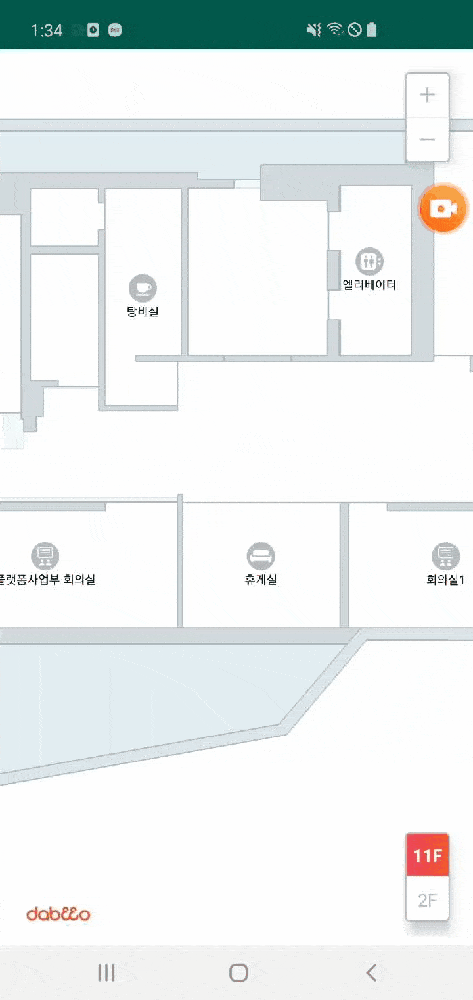

## Add Event

플랫폼에디터에서 작업한 POI, Custom DrawObjects 객체에 Event를 추가하는 액티비티 입니다.

| PoiEventActivity | DrawObjectsEventActivity |
| :---: | :---: |
|  |  |

## Sample Code

- PoiEventActivity.kt
	```kotlin
	private val mMarkerEvent = object : DrawEvent<Marker>() {
        override fun click(drawObject: Marker?) {
            // do something
        }
    }

    private fun initPoiEvent() {
        mMapView?.poiData?.forEach { marker ->
            marker.event = mMarkerEvent
        }
    }

    private val mMapEvent = object : MapEvent() {
        override fun ready(mapView: MapView?, mapInfo: MapInfo?) {
            initPoiEvent()
            // do something
        }

        override fun floorEnd(floorInfo: FloorInfo?, reason: Reason?) {
            initPoiEvent()
            // do something
        }

        override fun error(code: String?, message: String?) {
            // handle error
        }
    }
	```

- DrawObjectsEventActivity.kt
    ```kotlin
    /**
     * DrawObjects Event
     */
    private val mPolygonEvent = object : DrawEvent<Polygon>() {
        override fun click(drawObject: Polygon?) {
            // do something
        }
    }

    private val mPolylineEvent = object : DrawEvent<Polyline>() {
        override fun click(drawObject: Polyline?) {
            // do something
        }
    }

    private val mCircleEvent = object : DrawEvent<Circle>() {
        override fun click(drawObject: Circle?) {
            // do something
        }
    }

    private val mMarkerEvent = object : DrawEvent<Marker>() {
        override fun click(drawObject: Marker?) {
            // do something
        }
    }


    Polygon(...).apply {
        event = mPolygonEvent
    }.addTo()

    Polyline(...).apply {
            event = mPolylineEvent
    }.addTo()

    Circle(...).apply {
        event = mCircleEvent
    }.addTo()

    Marker(...).apply {
        event = mMarkerEvent
    }.addTo()
    ```